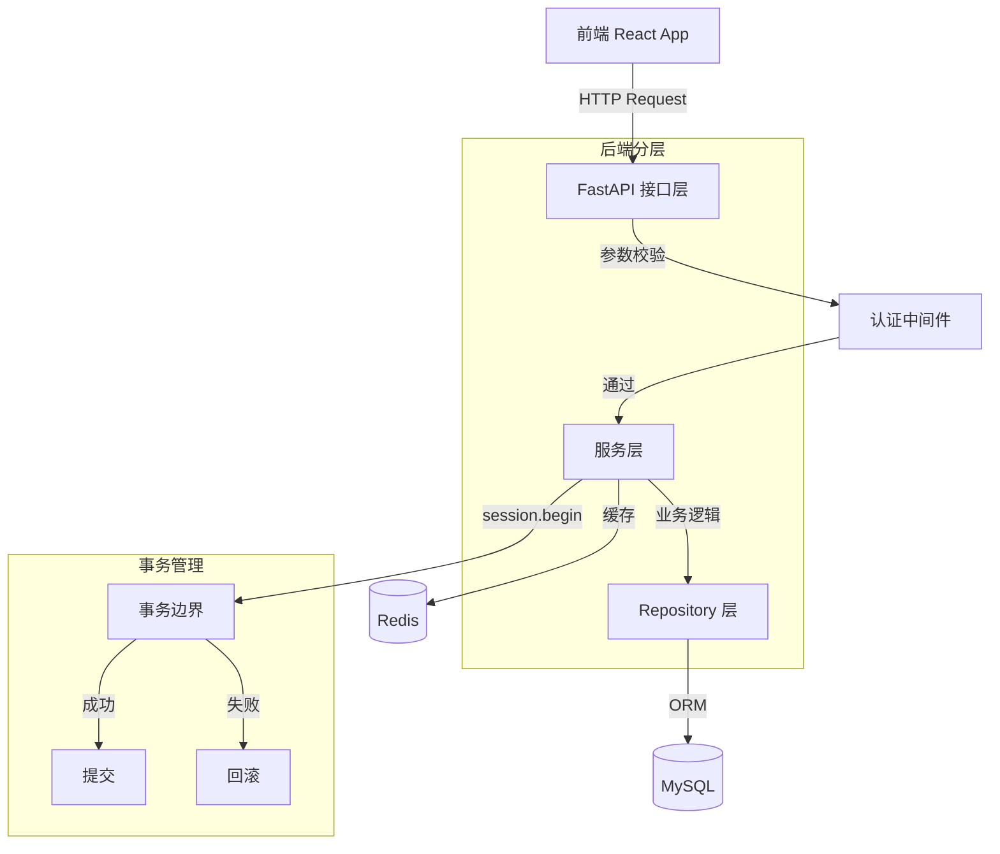

## 用户需求

为 OntoMind 项目设计一套完整的开发代码规范，让大模型在项目开发中遵守。

## 产品概述

创建全栈开发规范文档和示例代码，涵盖后端分层架构、前端代码组织、数据库设计、API 设计等方面。规范将确保代码结构清晰，职责分离明确，事务控制合理。

## 核心功能

- **后端分层架构规范**：接口层（API Router）、服务层（Service）、数据层（Model/Repository）的明确职责划分
- **事务控制规范**：服务层控制事务边界，使用 SQLAlchemy session 管理，确保接口原子性
- **后端开发标准文档**：包含代码组织、命名规范、错误处理、依赖注入等最佳实践
- **前端开发标准文档**：包含组件组织、状态管理、API 服务层、类型定义规范
- **API 设计标准**：RESTful API 设计规范、版本管理、错误处理、认证授权
- **数据库设计标准**：ORM 模型规范、迁移管理、索引策略
- **完整示例模块**：以用户模块为例，实现完整的分层架构示例代码

## 技术栈选择

- **后端**：Python 3.12 + FastAPI + SQLAlchemy 2.0 + Pydantic v2 + Alembic
- **前端**：React 19 + TypeScript + Ant Design 6 + Zustand + Axios
- **数据库**：MySQL 8.0 + Redis 7

## 实现方案

### 后端分层架构设计

#### 三层架构模式

```
┌─────────────────────────────────────────────────────────┐
│                    API Layer (接口层)                    │
│  - FastAPI Routers                                      │
│  - 请求参数校验 (Pydantic v2)                           │
│  - 响应格式化                                           │
│  - 认证/授权检查                                        │
│  - 事务边界控制 (调用 Service 层)                       │
└─────────────────────────────────────────────────────────┘
                           ↓
┌─────────────────────────────────────────────────────────┐
│                  Service Layer (服务层)                  │
│  - 业务逻辑实现                                         │
│  - 事务管理 (session.begin())                          │
│  - 数据验证与业务规则                                   │
│  - 调用 Repository 层获取数据                           │
│  - 复杂业务编排                                         │
└─────────────────────────────────────────────────────────┘
                           ↓
┌─────────────────────────────────────────────────────────┐
│                Data Layer (数据层)                       │
│  - ORM Models (SQLAlchemy Declarative)                 │
│  - Repository/DAO 模式                                 │
│  - 数据库查询封装                                       │
│  - 不处理业务逻辑                                       │
└─────────────────────────────────────────────────────────┘
```

#### 事务控制策略

1. **事务边界**：在服务层（Service Layer）控制事务，使用 `session.begin()` 上下文管理器
2. **原子性保证**：接口层不直接操作数据库，通过服务层确保操作的原子性
3. **自动提交/回滚**：使用装饰器或上下文管理器自动处理事务提交和异常回滚
4. **Session 管理**：使用 FastAPI 的 dependency injection 提供 session，服务层接收 session 参数

#### 关键设计决策

- **Repository 模式**：在数据层使用 Repository 模式封装数据库操作，服务层通过接口访问数据
- **Unit of Work 模式**：确保相关业务操作在同一个事务中完成
- **依赖注入**：通过 FastAPI 的 Depends 实现层间解耦
- **Pydantic v2 校验**：在接口层使用 Pydantic 进行严格的输入输出校验

### 前端架构设计

#### 代码组织模式

```
frontend/src/
├── types/          # TypeScript 类型定义
├── services/       # API 服务层（axios 封装）
├── stores/         # Zustand 状态管理
├── components/     # 可复用组件
├── pages/          # 页面组件
└── utils/          # 工具函数
```

#### 关键设计决策

- **Service 层封装**：统一 API 调用，处理请求/响应拦截
- **类型安全**：使用 TypeScript 严格模式，API 响应类型化
- **状态管理**：Zustand 按功能模块拆分 store
- **错误处理**：统一错误处理和用户反馈机制

## 实现要点

### 后端规范要点

1. **目录结构**：

- `app/api/v1/` - 接口层（按功能模块拆分文件）
- `app/services/` - 服务层（按功能模块拆分文件）
- `app/db/models/` - 数据模型（ORM 定义）
- `app/db/repositories/` - 数据访问层（Repository 模式）
- `app/schemas/` - Pydantic 校验模型（请求/响应 Schema）

2. **命名规范**：

- 接口层：`{module}.py`，路由函数使用动词+名词，如 `create_user`
- 服务层：`{module}_service.py`，类名 `{Module}Service`，方法名动词开头
- 数据层：`{module}_model.py`，类名 `{Module}`（PascalCase）
- Repository：`{module}_repository.py`，类名 `{Module}Repository`

3. **事务管理示例**：

```python
# 服务层事务控制
class UserService:
    def __init__(self, db: Session):
        self.db = db
        self.user_repo = UserRepository(db)
    
    def create_user_with_profile(self, data: UserCreate) -> User:
        with self.db.begin():
            user = self.user_repo.create(data)
            profile = self.profile_repo.create(user.id, data.profile)
            # 如果任何操作失败，整个事务回滚
            return user
```

### 前端规范要点

1. **类型定义优先**：所有 API 请求/响应必须有 TypeScript 类型定义
2. **Service 层抽象**：API 调用封装在 service 函数中，页面组件不直接调用 axios
3. **状态管理模块化**：每个功能模块有独立的 Zustand store
4. **组件设计**：展示组件与容器组件分离

## 架构设计

### 系统架构图



### 数据流设计

1. **请求流程**：前端 → API 接口层（参数校验）→ 服务层（事务控制）→ Repository 层（数据访问）→ 数据库
2. **响应流程**：数据库 → Repository 层 → 服务层（业务处理）→ API 接口层（响应格式化）→ 前端

## 目录结构

### 后端规范文档和实现

```
backend/
├── STANDARDS.md              # [NEW] 后端开发规范文档
├── app/
│   ├── api/
│   │   └── v1/
│   │       ├── __init__.py
│   │       ├── auth.py       # [MODIFY] 按规范重构
│   │       ├── user.py       # [NEW] 用户模块接口层示例
│   │       ├── perception.py # [MODIFY] 按规范重构
│   │       └── ...
│   ├── services/
│   │   ├── __init__.py
│   │   ├── user_service.py   # [NEW] 用户模块服务层示例
│   │   └── base_service.py   # [NEW] 服务层基类/工具
│   ├── db/
│   │   ├── models/
│   │   │   ├── __init__.py   # [NEW] 模型导出
│   │   │   ├── base.py       # [NEW] 基础模型类
│   │   │   └── user_model.py # [NEW] 用户模型示例
│   │   ├── repositories/
│   │   │   ├── __init__.py   # [NEW] Repository 导出
│   │   │   ├── base_repo.py  # [NEW] Repository 基类
│   │   │   └── user_repo.py  # [NEW] 用户 Repository 示例
│   │   ├── session.py        # [MODIFY] 增强 session 管理
│   │   └── __init__.py
│   ├── schemas/
│   │   ├── __init__.py
│   │   ├── user_schema.py    # [NEW] 用户 Pydantic Schema 示例
│   │   └── base_schema.py    # [NEW] 基础 Schema 类
│   └── core/
│       ├── dependencies.py   # [NEW] FastAPI 依赖注入
│       ├── exceptions.py     # [NEW] 统一异常处理
│       └── config.py         # [MODIFY] 添加规范相关配置
```

### 前端规范文档和实现

```
frontend/
├── STANDARDS.md              # [NEW] 前端开发规范文档
└── src/
    ├── types/
    │   ├── user.ts           # [NEW] 用户模块类型定义示例
    │   └── index.ts         # [NEW] 类型导出
    ├── services/
    │   ├── user.service.ts   # [NEW] 用户模块 API 服务示例
    │   └── index.ts         # [MODIFY] 添加服务导出
    ├── stores/
    │   ├── userStore.ts      # [NEW] 用户状态管理示例
    │   └── appStore.ts      # [MODIFY] 按规范优化
    └── utils/
        ├── request.ts        # [NEW] 请求工具函数
        └── constants.ts      # [NEW] 常量定义
```

## 关键代码结构

### 后端事务管理装饰器

```python
from functools import wraps
from sqlalchemy.orm import Session

def transactional(func):
    """服务层事务管理装饰器"""
    @wraps(func)
    def wrapper(self, *args, **kwargs):
        with self.db.begin():
            return func(self, *args, **kwargs)
    return wrapper
```

### Repository 基类接口

```python
class BaseRepository(Generic[ModelType]):
    def __init__(self, model: Type[ModelType], db: Session):
        self.model = model
        self.db = db
    
    def get(self, id: int) -> Optional[ModelType]:
        return self.db.query(self.model).filter(self.model.id == id).first()
    
    def create(self, obj_in: dict) -> ModelType:
        db_obj = self.model(**obj_in)
        self.db.add(db_obj)
        self.db.flush()  # 获取 ID 但不提交
        return db_obj
```

### 前端 Service 层示例

```typescript
// services/user.service.ts
import api from './index';
import { User, UserCreateRequest, UserResponse } from '../types/user';

export const userService = {
  getUsers: () => api.get<UserResponse>('/users'),
  getUser: (id: number) => api.get<User>(`/users/${id}`),
  createUser: (data: UserCreateRequest) => api.post<User>('/users', data),
  updateUser: (id: number, data: Partial<UserCreateRequest>) => 
    api.put<User>(`/users/${id}`, data),
  deleteUser: (id: number) => api.delete(`/users/${id}`),
};
```

## Agent Extensions

### SubAgent

- **code-explorer**
- 用途：深入探索现有代码库，了解当前实现模式，确保新规范与现有代码风格一致
- 预期结果：获取完整的项目代码结构信息，为规范设计提供准确的上下文