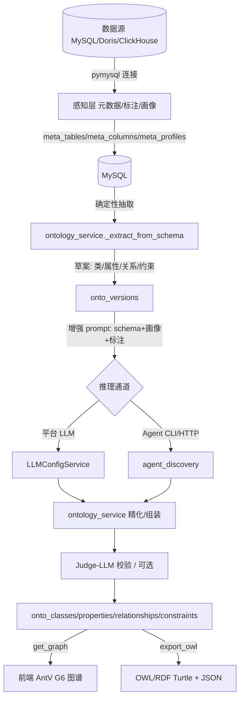

## 用户需求

从感知层到认知层打通一条「数据 → 本体」的自动构建链路：感知层在已有元数据与 LLM 标注基础上，新增数据画像（枚举/值域/格式检测）以支撑更精准的约束抽取；认知层结合标注好的数据，自动进行实体、关系、约束抽取，并组装为本体与本体图谱，对外可视化与导出。

## 产品概述

一个面向关系型数据源（MySQL/Doris/ClickHouse）的本体自动构建工作台。用户在感知层完成元数据同步与 LLM 标注后，一键触发认知层构建：系统先用确定性规则从库表结构（主键/外键/字段类型/数据画像）抽取实体、关系与约束草案，再用平台 LLM 或指定 Agent 进行语义增强与本体组装，最后以图谱形式可视化并提供 OWL/RDF、JSON 导出。

## 核心功能

- 数据画像：对每张表抽样统计，自动识别枚举值、格式（邮箱/手机/URL/日期）、空值率、唯一性，落库支撑约束抽取
- 实体抽取：将带主键或实体标记的表映射为本体类（实体），并补全业务域与实体类型
- 关系抽取：将外键映射为本体对象属性（关系），推断 domain/range 与基数
- 约束抽取：从结构、画像与标注生成基数/枚举/值域/格式/函数性/逆等约束，标注来源与置信度
- 本体构建：确定性草案 + LLM/Agent 增强 + Judge-LLM 校验三段式（借鉴 RIGOR），产出可版本化本体
- 本体图谱：AntV G6 可视化实体-关系网络，点击下钻查看属性与约束
- 多通道推理：构建时可在「平台 LLM / Agent（OpenClaw、OpenCode）」间切换，WebSocket 流式展示过程
- 导出：本体导出为 OWL/RDF (Turtle) 与 JSON

## 技术栈选择

- 后端：沿用 FastAPI + SQLAlchemy 2.0 + MySQL（项目统一存储，零新增基础设施）
- 本体建模：MySQL 关系表（onto_ 系列），导出时用 rdflib 序列化为 OWL/RDF
- LLM 推理：复用 `LLMConfigService`（openai/qwen/anthropic）作为兜底；Agent（CLI/HTTP）走已有 `agent_discovery` 封装
- 前端：React 19 + TypeScript + Ant Design 5（沿用现有暗色主题）+ AntV G6（图谱可视化）
- 流式交互：WebSocket（沿用 `/perception/meta/tables/{id}/annotate/stream` 的事件协议）

## 实现方案

### 总体策略

以「确定性抽取 → LLM/Agent 增强 → Judge 校验」三段式流水线（参考 RIGOR 论文），先由库表结构零成本生成本体草案，再调用大模型做语义精化与本体组装，最后用校验器保证一致性与可读性。整条链路以「数据源 → 版本化本体」建模，所有产物落 MySQL，图谱与导出按需派生。

### 关键技术决策

1. **存储用 MySQL 关系表而非图数据库**：遵循用户决策与项目「统一 MySQL 存储」原则，避免引入 Neo4j 基础设施；本体以 T-Box（类/属性/关系/约束）关系表表达，图遍历在查询时按需构造为 nodes/edges。
2. **感知层增强聚焦「数据画像」**：新增 `meta_profiles` 表（按列），抽样统计空值率、去重数、最值、格式正则、枚举候选。画像结果直接驱动约束抽取（枚举→值约束、唯一→函数性、空值率为 0→最小基数 1），比纯 schema 推断更准。
3. **双通道推理可切换**：复用 `metadata_service.auto_annotate` 已有的「平台 LLM / Agent CLI / Agent HTTP」三态调用范式，新写 `ontology_service` 的增强步骤统一走同一抽象，前端通过构建面板选择通道，过程沿用 WebSocket 事件协议（status/thinking/text/tool_use/error/applied/done）。
4. **模型调用次数有界**：v1 先用确定性规则一次性产出完整草案（无 LLM 调用）；增强阶段对「整库 schema 摘要 + 画像」做 1~2 次 LLM 调用（而非逐表 N 次），兼顾质量与成本；Judge 校验为可选独立步骤。
5. **约束建模独立成表**：`onto_constraints` 以 `target_type+target_id` 关联类/属性/关系，约束类型枚举化（cardinality/enum/range/pattern/functional/inverse/transitive/symmetric），保留 `source`（schema/profile/llm/agent）与 `confidence`，支持人工编辑与溯源。

### 性能与可靠性

- 画像采样上限（默认 5000 行）且 `SELECT col,... LIMIT N` 单趟读取；枚举检测用 `GROUP BY col ORDER BY cnt DESC LIMIT K` 而非全量去重；避免对大表做 `COUNT(DISTINCT)` 全扫。
- LLM 增强统一超时与重试（沿用 `LLMConfigService` 的 max_retries），Agent CLI 沿用 `asyncio.create_subprocess_exec` + 180s 超时 + ANSI 清理。
- 本体构建为可版本化操作，`onto_versions.status` 标记 building/ready/failed，失败时保留已生成部分并写 error，便于前端重试与排查。
- 图谱数据在 `get_graph` 按数据源/版本聚合，节点量级为「实体数」通常数百，G6 可承载；超大 schema 前端按库筛选。

### 实现要点（防回归）

- 沿用 `Base.metadata.create_all` 自动建表（main.py 已启用），新增 ORM 模型只需在 `models/__init__.py` 注册，无需手写 alembic（与现有 meta 表一致）。
- 复用 `app/db/repositories/metadata_repo.py` 的 Repository 模式新建 `ontology_repo.py`，Service 层不直写 SQL。
- WebSocket 构建接口严格复用标注流的事件类型，前端无需新增协议解析。
- 日志沿用项目既有异常体系（`BusinessException`/`NotFoundException`），不新增日志框架；LLM 入参/出参不落敏感字段。

## 架构设计



## 目录结构

```
backend/
├── app/db/models/
│   ├── ontology_model.py      # [NEW] OntologyVersion / OntologyClass / OntologyProperty /
│   │                           #        OntologyRelationship / OntologyConstraint 五个 ORM 模型
│   ├── metadata_model.py      # [MODIFY] 新增 MetaProfile 模型（按列画像：空值率/去重数/枚举/
│   │                           #          格式/最值），MetaColumn 增加 profile_status 标记
│   └── __init__.py            # [MODIFY] 注册 Ontology* 与 MetaProfile 模型
├── app/repositories/
│   └── ontology_repo.py       # [NEW] 本体各表 CRUD 仓储（沿用 metadata_repo 模式）
├── app/services/
│   ├── metadata_service.py    # [MODIFY] 新增 profile_data(table_id) 抽样画像 + get_profile()，
│   │                           #          将枚举/格式/唯一性写入 meta_profiles
│   └── ontology_service.py    # [NEW] build_ontology（确定性抽取+LLM/Agent增强+Judge校验）、
│   │                           #          export_owl(version_id, fmt)、get_graph(version_id)、validate()
├── app/api/v1/
│   ├── perception.py          # [MODIFY] 新增 POST /meta/tables/{id}/profile、
│   │                           #          GET /meta/columns/{id}/profile
│   └── cognition.py           # [MODIFY] 替换 5 个 stub：versions 增删查、entities/relationships/
│   │                           #          constraints 查询与编辑、graph、export、validate，
│   │                           #          新增 WS /ontology/build/stream 流式构建
└── requirements.txt           # [MODIFY] 增加 rdflib（OWL 导出）

frontend/
├── src/
│   ├── services/index.ts      # [MODIFY] 扩展 cognitionAPI：build/versions/graph/export/validate
│   │                           #          + buildStreamUrl(version 参数)；新增 perceptionAPI.profileTable
│   ├── pages/perception/index.tsx   # [MODIFY] 表详情 Drawer 新增「数据画像」按钮并展示枚举/值域/格式
│   └── pages/cognition/index.tsx    # [MODIFY] 重做：G6 图谱 + 实体/关系/约束表格 + 构建面板 + 导出
└── package.json               # [MODIFY] 增加 @antv/g6 依赖
```

## 关键代码结构

本体模型（核心依赖，多模块共用）：

- `OntologyVersion`: datasource_id, name, status(building/ready/failed), method(rules/llm/agent), llm_model, agent_id, stats(JSON: entity/relation/constraint 计数), error
- `OntologyClass`: version_id, source_table_id, local_name(IRI 局部名), label, definition, domain, entity_type, is_entity, confidence
- `OntologyProperty`: version_id, class_id(domain 类), name, property_type(data/object), range_type(xsd 类型或类 local_name), source_column_id, related_class_id(对象属性指向), semantic_type, confidence
- `OntologyRelationship`: version_id, from_class_id, to_class_id, name, source_column_id, cardinality(如 0..1/1), confidence
- `OntologyConstraint`: version_id, target_type(class/property/relationship), target_id, constraint_type(cardinality/enum/range/pattern/functional/inverse/transitive/symmetric), expression(JSON/文本), severity(info/warn/error), source(schema/profile/llm/agent), confidence

构建入口签名：`ontology_service.build_ontology(datasource_id, method, llm_config_id=None, agent_id=None, table_ids=None, use_judge=False) -> OntologyVersion`

## 设计思路

沿用项目现有暗色科技风（App.tsx 的 darkAlgorithm + 蓝色主色 + 紫色点缀），认知层页面从占位卡片重做为「构建控制台 + 本体图谱 + 明细表格」三区布局。图谱区用 AntV G6 渲染实体节点与关系边，节点按业务域着色、约束以徽标/悬浮卡呈现；点击节点下钻到右侧抽屉查看属性与约束。构建面板支持「规则 / 平台 LLM / Agent」通道切换与实时进度，整体保持玻璃质感与微交互。

## 页面区块

- 顶部构建栏：数据源选择、构建模式切换（规则/平台LLM/Agent）、构建按钮、进度与状态
- 主区（左，flex 1）：AntV G6 本体图谱画布（力导向/层级布局，节点=实体，边=关系，悬浮显示约束）
- 主区（右或 Tab）：实体表 / 关系表 / 约束表，支持筛选、编辑、置信度展示
- 下钻抽屉：选中实体 → 展示属性列表、约束列表、关联关系，可编辑
- 导出栏：OWL/Turtle 与 JSON 导出按钮、Judge 校验按钮
- 感知层表详情 Drawer：新增「数据画像」按钮，展示枚举候选、格式识别、空值率、唯一性

## 交互与动效

- 图谱节点载入淡入、hover 高亮邻接边、点击节点其他节点降透明度聚焦
- 构建过程以步骤条 + 流式日志呈现 Agent 思考/执行
- 表格行 hover 微高亮，抽屉滑入缓动