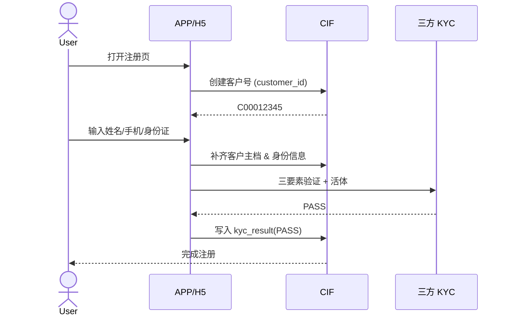

# 客户中心 (CIF) — BRD 业务需求文档

- **系统代号**：CIF
- **文档版本**：v1.0
- **发布日期**：2024-11-15
- **文档负责人**：产品经理 E00023 张明宇
- **审批状态**：已发布

## 一、业务背景

信优消费金融有限公司（下称"公司"）作为持牌消金机构，业务覆盖自营信贷、助贷、联合贷、担保业务四大产品线，需要一套统一的客户信息中心（Customer Information File, CIF）作为**全公司客户主数据的单一权威来源（Golden Source）**。

历史上公司经历了从"单产品单库"到"多产品多库"的发展路径，客户资料被冗余存储于进件、信贷、催收、财务等多个系统中，导致：
- **同一客户多套档案**，字段口径不一致（如"客户姓名"在不同系统 encoding 不同）
- **KYC 结果散落**，无法快速判断某客户当前认证状态
- **合规报送困难**，人行、监管报表口径难以对齐
- **客户体验差**，一次实名 N 次录入

CIF 系统的建设目标是**一次录入、全公司共享**。

## 二、目标用户

| 用户角色 | 主要诉求 |
|---|---|
| 内部业务人员（客服、审核、催收） | 快速定位客户、查看完整档案、判断风险 |
| 上游进件系统 | 拿到客户主档 ID、当前 KYC 状态 |
| 下游信贷/风控/财务系统 | 通过 `customer_id` 拉客户资料，做业务 |
| 数据部门 | 客户主数据加工进数仓，供分析与报表 |
| 合规部门 | 输出监管所需的客户身份、地址、KYC 报送 |

## 三、业务价值

1. **单一事实来源**：全公司客户档案唯一，杜绝"多头档案"
2. **降低对接成本**：新业务系统接入 CIF 即刻拿到客户全景
3. **提升客户体验**：一次 KYC 全场景可用（跨产品复用）
4. **合规能力**：满足《个人金融信息保护技术规范》、《消费金融公司管理办法》
5. **数据资产化**：为 Data Agent、指标平台提供高质量客户主数据底座

## 四、关键业务流程

### 4.1 新客户开户

### 4.2 客户信息变更

- 手机号变更：需 KYC 二次验证（人脸 + 原手机号验证码）
- 地址变更：直接更新，保留历史地址（`is_current=0`）
- 联系人变更：不允许覆盖，只允许追加
- 关键字段（姓名/身份证）：**不允许修改**，只能销户重开

### 4.3 客户注销

- 客户主动申请注销
- 系统校验：是否有未结清贷款、未处理工单
- 通过后：`status=CLOSED`，KYC 数据保留 5 年（合规要求）

## 五、相关系统

| 系统 | 关系 | 交互内容 |
|---|---|---|
| 进件受理 (loan_intake) | 上游 | 提供 customer_id、拉取 KYC 状态 |
| 风险决策 (risk_decision) | 下游 | 拉客户身份/地址做反欺诈判定 |
| 信贷核心 (credit_core) | 下游 | 拉客户资料做授信 |
| 催收 (collection) | 下游 | 拉联系方式（含紧急联系人） |
| 财务 (finance) | 下游 | 拉客户信息做结算凭证 |
| 客服 (csm) | 下游 | 拉客户信息处理工单 |

## 六、合规要求

- **《个人金融信息保护技术规范》** JR/T 0171-2020
  - C3 级信息（身份证号、银行卡号）需加密存储
  - 明文展示需脱敏（如 `130****1234`）
- **《消费金融公司管理办法》** 银保监会令 2024 年第 8 号
  - 客户资料保存 ≥ 5 年（贷款结清或注销之日起）
- **《金融消费者权益保护实施办法》**
  - 客户资料修改需留痕
  - 客户有权导出/查询自己的完整档案

## 七、关键业务指标（BRD 视角）

| 指标 | 目标 |
|---|---|
| 客户主档完整率 | ≥ 99.5% |
| 三要素 + 活体通过率 | ≥ 92% |
| 平均开户时长 | ≤ 90 秒 |
| 客户资料日增量 | 与新增申请量匹配（±5%） |
| 敏感字段加密覆盖率 | 100% |
| 客服投诉率（客户资料相关） | ≤ 0.05% |

## 八、暂不覆盖（Out of Scope）

- 客户画像（属于风险决策 + 数据部门职责）
- 客户等级评分（属于风险决策）
- 营销标签管理（属于营销部门与数仓）
- 客户信用报告（外部征信接入，属于进件系统职责）

## 九、里程碑（历史交付）

| 阶段 | 时间 | 交付内容 |
|---|---|---|
| V1.0 需求评审 | 2024-11-15 | 本 BRD 通过 |
| V1.0 上线 | 2025-01-01 | 主档 + 身份 + 地址 + 联系 + KYC + 标签 |
| V1.1 规划 | 2025-Q3 | 客户 360 视图、跨产品去重 |
| V2.0 规划 | 2026-H1 | 客户生命周期管理、跨机构联合建模 |
