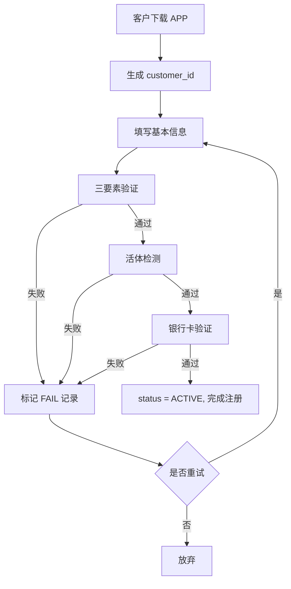

# 客户中心 (CIF) — PRD 产品需求文档

- **产品名称**：客户中心 CIF
- **产品版本**：v1.0
- **文档版本**：v1.0
- **产品经理**：张明宇 E00023
- **UI 设计**：见 [Figma 链接（虚构）]
- **交互稿**：见附件

## 一、产品范围

客户中心 CIF 是公司内部的**客户主数据平台**，为进件、风控、信贷、催收、财务、客服等下游系统提供统一的客户信息读写能力。

**在范围内**：
- 客户主档 CRUD
- 身份/证件管理
- 地址（多类型多版本）
- 联系方式（手机、邮箱、紧急联系人）
- KYC 认证结果留档
- 客户标签管理

**不在范围内**：
- 客户信用评估（→ risk_decision）
- 客户画像（→ 数仓 + Data Agent）
- 客户信用报告拉取（→ loan_intake）
- 客户资金账户（→ credit_core / finance）

## 二、用户角色 & 权限

| 角色 | 权限 |
|---|---|
| 客户 | 通过 APP/H5 触发写入自己的信息（有限字段） |
| 客服 | 只读客户档案；备注/补充非核心字段 |
| 审核员 | 只读，用于对比进件资料 |
| 合规官 | 只读，含加密字段解密权限（审计留痕） |
| 系统对接账号 | API 读写（按业务分权限白名单） |

## 三、核心用例

### UC-01 客户注册

- **触发**：客户下载 APP 首次打开
- **前置**：无
- **主流程**：
  1. 生成 `customer_id` (格式：`C` + 8 位递增序号)
  2. 收集：姓名 / 性别 / 生日 / 手机号 / 身份证号 / 学历 / 婚姻 / 职业 / 月收入
  3. 触发 3 步 KYC：实名（人行三要素） → 活体（人脸检测） → 银行卡验证
  4. 记录注册渠道、注册时间、状态置为 `ACTIVE`
- **后置**：客户档案入库，同步下游

### UC-02 客户资料查询

- **触发**：内部业务人员在业务台查询
- **主流程**：
  1. 按 `customer_id` / `id_number` / `phone` / `name` 检索（后 3 者需权限）
  2. 展示：主档 + 身份 + 地址 + 联系人 + KYC 结果 + 标签
  3. 敏感字段脱敏展示（如身份证号仅显示前 6 后 4）
  4. 每次查询留审计日志

### UC-03 客户信息更新

按字段分类：
- **不可变字段**：姓名、身份证号（这两个变更 = 销户重开）
- **需 KYC 二次验证**：手机号、银行卡
- **直接更新（保留历史）**：地址、职业、月收入
- **只能追加**：紧急联系人

### UC-04 KYC 认证

- **触发**：注册 / 变更手机号 / 变更银行卡
- **步骤**：
  1. 采集身份证正反面 → OCR
  2. 三要素校验（姓名+身份证+手机号，人行 API）
  3. 活体检测（火眼/云脸 SDK）
  4. 银行卡四要素校验（姓名+身份证+手机号+卡号）
- **结果**：每步写 `kyc_result` 一条记录（PASS/FAIL + fail_reason）

### UC-05 客户注销

- **前置检查**：无未结清贷款、无未关闭工单
- **动作**：`status → CLOSED`，冻结 KYC，5 年后可归档

## 四、功能列表

| 功能 | 页面/接口 | 描述 |
|---|---|---|
| 新建客户 | POST /cif/customer | 主档创建 |
| 更新客户 | PUT /cif/customer/{id} | 有限字段变更 |
| 查询客户 | GET /cif/customer/{id} | 单条 |
| 检索客户 | GET /cif/customer | 分页 + 权限过滤 |
| 添加地址 | POST /cif/address | 新增地址 |
| 添加联系人 | POST /cif/contact | 新增联系方式 |
| 提交 KYC | POST /cif/kyc | 上传 KYC 结果 |
| 客户注销 | POST /cif/customer/{id}/close | 销户 |
| 打标签 | POST /cif/tag | 添加/修改标签 |

## 五、流程图

## 六、交互规则

- **敏感字段展示**：默认脱敏，具备权限的用户点击"查看明文"按钮时触发二次验证 + 审计日志
- **地址切换**：老地址不删除，新地址 `is_current=1`，老地址 `is_current=0`
- **紧急联系人**：至少 1 个（关系为父母/配偶/兄弟姐妹），最多 3 个
- **手机号**：唯一性约束（同一手机号只能注册一个客户）
- **实名认证**：同一身份证号唯一，禁止重复注册

## 七、数据规则

| 字段 | 类型 | 校验规则 |
|---|---|---|
| customer_id | VARCHAR(16) | `^C\d{8}$`，自动生成 |
| name | VARCHAR(64) | 长度 2-32，中文/英文/数字 |
| id_number | VARCHAR(32) | 身份证号校验位算法 |
| phone | VARCHAR(32) | `^1[3-9]\d{9}$` |
| monthly_income | DECIMAL(12,2) | ≥ 0 且 ≤ 1000000 |
| birth_date | DATE | 年龄 ≥ 18 且 ≤ 60 |
| gender | TINYINT | 1 男 / 2 女 |

## 八、验收标准

- [x] 支持 10 万级客户并发查询（P95 < 200ms）
- [x] 三要素通过率 ≥ 92%
- [x] 敏感字段 100% AES 加密存储
- [x] 审计日志留存 ≥ 3 年
- [x] 与进件、风控、催收系统联调通过
- [x] 单元测试覆盖率 ≥ 85%
- [x] 通过安全渗透测试

## 九、非功能需求

- **可用性**：99.9%（全年停机 ≤ 8.76 小时）
- **性能**：P95 读 ≤ 200ms，P95 写 ≤ 500ms
- **安全**：符合等保 3.0
- **可扩展**：客户数增长到 1000 万级仍可支撑（分库分表方案预留）
