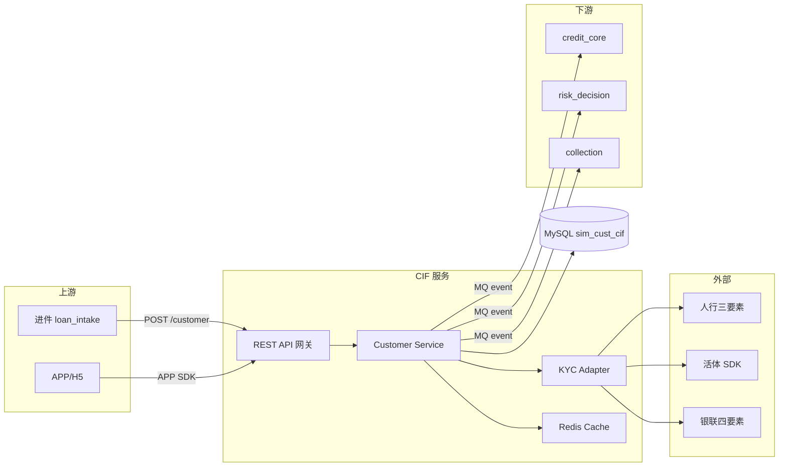
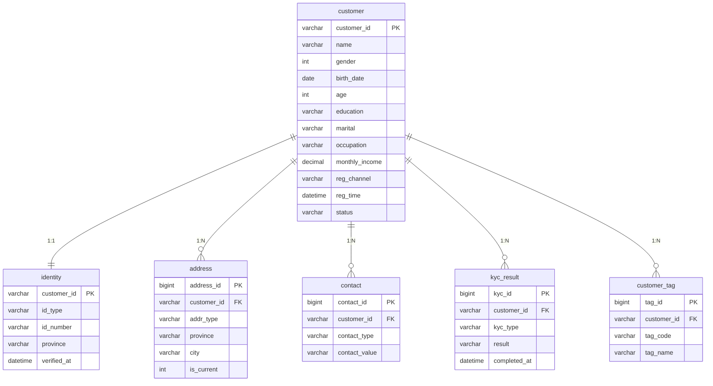

# 客户中心 (CIF) — TDD 技术设计文档

- **技术负责人**：架构师 E00089 王一凡
- **文档版本**：v1.0
- **修订日期**：2024-12-01

## 一、总体架构



## 二、技术选型

| 层 | 技术 |
|---|---|
| 编程语言 | Java 17 (Spring Boot 3.2) |
| 数据库 | MySQL 8.0（主从），逻辑库 `sim_cust_cif` |
| 缓存 | Redis 7.0 Cluster |
| 消息 | RocketMQ 5.x（事件驱动同步下游） |
| 加密 | AES-256-GCM（业务字段），bcrypt（密码类） |
| 网关 | Spring Cloud Gateway + JWT |
| 监控 | Prometheus + Grafana + SkyWalking |
| 部署 | Kubernetes（阿里云 ACK） |

## 三、数据模型（ER 图）



**完整 DDL**：`sim/systems/01_cust_cif/schema.sql`

## 四、关键接口清单

（伪 OpenAPI）

```yaml
paths:
  /cif/customer:
    post:
      summary: 创建客户
      requestBody:
        content:
          application/json:
            schema:
              type: object
              required: [name, gender, birth_date, phone, id_number]
              properties:
                name: {type: string}
                gender: {type: integer, enum: [1, 2]}
                birth_date: {type: string, format: date}
                phone: {type: string}
                id_number: {type: string}
                monthly_income: {type: number}
                reg_channel: {type: string}
      responses:
        '201':
          content:
            application/json:
              schema:
                type: object
                properties:
                  customer_id: {type: string, example: "C00012345"}
                  status: {type: string, example: "ACTIVE"}

  /cif/customer/{customer_id}:
    get:
      summary: 查询客户档案
      parameters:
        - name: include
          in: query
          description: "逗号分隔：identity,address,contact,kyc,tag"

  /cif/kyc:
    post:
      summary: 提交 KYC 结果
      requestBody:
        content:
          application/json:
            schema:
              type: object
              properties:
                customer_id: {type: string}
                kyc_type: {type: string, enum: [REAL_NAME, FACE, BANK_CARD]}
                result: {type: string, enum: [PASS, FAIL]}
                fail_reason: {type: string}
```

## 五、关键算法/机制

### 5.1 customer_id 生成

- **格式**：`C` + 8 位数字（序号）
- **实现**：Redis INCR 全局序号 + 后台补零
- **容量**：99,999,999 客户，够用 20 年

### 5.2 敏感数据加密

- **算法**：AES-256-GCM
- **KMS**：阿里云 KMS 托管密钥，客户维度独立 IV
- **入库**：`id_number_enc` 存密文，`id_number_last4` 明文（供索引）
- **展示**：默认脱敏，权限用户查明文时下发临时解密令牌 + 审计

### 5.3 唯一性约束

MySQL 层：
```sql
UNIQUE KEY uk_id_number (id_number_hash),  -- 用 hash 保证唯一性且不泄漏原文
```
应用层：注册前再走一次 Redis Bloom Filter 前置去重。

### 5.4 事件通知

写事件到 RocketMQ Topic `cif_customer_events`：
```json
{
  "event_id": "uuid",
  "event_type": "CUSTOMER_CREATED",
  "customer_id": "C00012345",
  "occurred_at": "2025-01-15T10:23:45Z",
  "trace_id": "..."
}
```

下游订阅：`risk_decision`、`credit_core`、`csm` 各自消费。

## 六、部署 & 环境

- 3 个环境：dev / test / staging / prod
- MySQL 主从（RPO ≤ 1s，RTO ≤ 30s）
- Redis 3 主 3 从
- 服务 Pod：4 replica，滚动更新

## 七、监控 & 告警

| 监控项 | 阈值 | 告警级别 |
|---|---|---|
| P95 读延迟 | > 500ms | WARN |
| P95 写延迟 | > 1s | WARN |
| KYC 失败率 | > 15% | CRIT |
| 数据库连接池使用率 | > 80% | WARN |
| MQ 消费积压 | > 10000 | CRIT |
| 三要素调用失败率 | > 5% | WARN |

## 八、安全设计

- 传输：TLS 1.3
- 存储：字段级加密 + 表全加密（TDE）
- 访问：全量审计日志（存 ClickHouse，保存 5 年）
- 权限：RBAC + 敏感数据二次授权
- 备份：每日全备 + Binlog 增量

## 九、容量规划

| 项 | 当前 | 3 年后预估 |
|---|---|---|
| 客户数 | 1000 万 | 5000 万 |
| QPS 读 | 500 | 3000 |
| QPS 写 | 100 | 800 |
| MySQL 存储 | 200 GB | 1.5 TB |
| 分库分表触发点 | 5000 万客户 | 已到 |

## 十、风险与降级

| 风险 | 应对 |
|---|---|
| 三要素接口挂 | 切换备用通道（人行 → 百融 → 同盾） |
| MySQL 主库故障 | 30 秒内切从库 |
| 缓存击穿 | 布隆过滤器 + 分布式锁 |
| 数据不一致 | 每日对账 + 异常修复脚本 |
