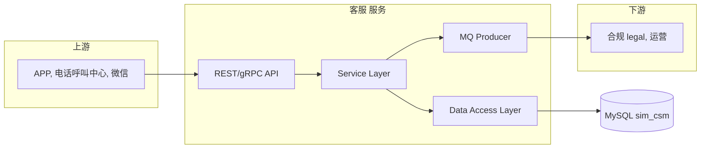

# 客服 — TDD 技术设计文档

- **技术负责人**：架构师
- **版本**：v1.0
- **数据库**：`sim_csm`

## 一、总体架构

## 二、技术选型

| 层 | 技术 |
|---|---|
| 语言 | Java 17 / Spring Boot 3 |
| 数据库 | MySQL 8.0（主从） |
| 缓存 | Redis 7 |
| MQ | RocketMQ 5 |
| 网关 | Spring Cloud Gateway |
| 监控 | Prometheus + Grafana + SkyWalking |
| 部署 | Kubernetes |

## 三、数据模型

表清单（DDL 见 `../../systems/10_csm/schema.sql`）：

    ticket : (详见 schema.sql)
call_record : (详见 schema.sql)
complaint : (详见 schema.sql)
ticket_action : (详见 schema.sql)

## 四、关键接口清单

- `POST /csm/...`
- `GET  /csm/...`
- `PUT  /csm/...`

详细契约见 OpenAPI 附件。

## 五、关键算法/机制

### 5.1 唯一 ID 生成
使用 Snowflake（或 UUID v7）保证全局唯一 & 时序单调。

### 5.2 状态机
核心业务表状态流转：
- 通过 `*_status_log` 表记录每次变更
- 变更需经过状态机校验合法性

### 5.3 事件通知
写事件到 RocketMQ Topic，下游消费。

## 六、部署 & 环境

- dev / test / staging / prod
- MySQL 主从
- Pod 副本数：4

## 七、监控 & 告警

| 监控项 | 阈值 |
|---|---|
| P95 读 | 300ms |
| P95 写 | 800ms |
| 错误率 | > 1% 告警 |
| 连接池 | > 80% 告警 |

## 八、安全设计

- TLS 1.3
- 字段级加密（敏感数据）
- RBAC
- 全量审计

## 九、容量规划

| 项 | 当前 | 3 年后 |
|---|---|---|
| QPS | 见基线 | 3–5x |
| 存储 | 见基线 | 需分库分表 |

## 十、风险与降级

- 依赖故障：熔断 + 降级
- 数据库故障：主从切换
- 缓存穿透：布隆过滤器

