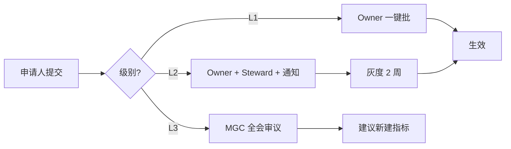

# 指标口径管理细则

## 一、什么是口径

**指标口径 = 业务定义 + 计算规则 + 过滤条件 + 去重维度 + 时间粒度**

口径决定了指标的**唯一含义**。口径不同即使名称相同也是不同指标。

## 二、口径要素

每个指标必须明确以下 8 个要素：

| # | 要素 | 说明 | 示例 |
|---|---|---|---|
| 1 | 业务定义 | 一句话说清算的是什么 | "当日在 APP 有登录/浏览/操作行为的去重用户数" |
| 2 | 计算公式 | 伪代码或数学公式 | `COUNT(DISTINCT user_id)` |
| 3 | 数据源 | 依赖的表 | `sim_dw.dws_customer_active_day` |
| 4 | SQL 模板 | 可直接执行的 SQL | 见 `sql_template` 字段 |
| 5 | 过滤条件 | WHERE 里加的条件 | `is_test_user=0 AND is_robot=0` |
| 6 | 去重维度 | 唯一性字段 | `user_id`（不是 device_id） |
| 7 | 时间粒度 | day/week/month/quarter/year | `day` |
| 8 | 计入规则 | 时间窗口的入选原则 | "自然日 00:00–23:59"、"滚动 30 天" |

## 三、常见口径陷阱

### 3.1 去重维度混淆

同一指标不同去重维度 = 不同指标：
- 按 `user_id` 去重 → 客户维度 DAU
- 按 `device_id` 去重 → 设备维度 DAU

**必须显式声明**。

### 3.2 时间窗口

- **自然日 vs 滚动 24 小时**：DAU 用自然日
- **业务日 vs 系统日**：跨零点交易归属哪天？
- **时区**：全公司统一 UTC+8（北京时间）

### 3.3 汇总口径

- 求和：`SUM(disburse_amount)` — 明确金额还是笔数
- 平均：加权 vs 简单平均
- 环比同比：分母是什么

### 3.4 除零处理

分母为 0 时：
- 显示 `NULL`（推荐）
- 显示 `0`（会误导）
- 显示 `INF`（不友好）

**统一约定：分母为 0 一律输出 NULL。**

## 四、口径变更流程

### 4.1 三级变更

| 级别 | 说明 | 举例 | 审批 | 落地 |
|---|---|---|---|---|
| **L1 无损** | 不影响历史数据的补充 | 新增别名、更清晰的描述 | Owner 单批 | 立即 |
| **L2 有损** | 计算规则微调，历史数据可回溯 | 加过滤条件 `is_robot=0` | Owner + Steward + Consumer 通知 | 灰度 2 周 |
| **L3 破坏性** | 语义/单位/主体变化 | 从"活跃用户"改为"活跃设备" | MGC 全员 | 建议新建 |

### 4.2 变更审批工作流



### 4.3 变更文档要求

每次变更都要在指标定义里加：

```yaml
change_log:
  - version: 1.1
    changed_at: 2025-05-01
    changed_by: E00023
    change_type: L2
    reason: 排除机器人账号
    diff: filters 增加 is_robot=0
```

## 五、旧口径并存

对于 L2/L3 变更，允许**新旧口径并存最多 6 个月**：
- 老指标 `dau_v1`：保持旧口径，只读
- 新指标 `dau_v2`：新口径，成为主口径

6 个月后 `dau_v1` 进入 `ARCHIVED`。

## 六、口径签认

新指标或口径变更 L2/L3 上线前，需要以下签认：

- [x] Owner：口径正确
- [x] Steward：SQL 实现无误
- [x] 抽样数据：至少 10 个日期结果一致
- [x] Consumer 通知：使用方无异议

## 七、口径违规

以下情况判定为违规：

1. **口径不透明**：报表未标注使用的指标 ID
2. **私自变通**：绕过指标平台直接改 SQL
3. **口径盗用**：报表标注 `dau` 但用了非标 SQL

违规处理：
- 首次：警告
- 二次：绩效扣分
- 三次：绩效通报

## 八、数据质量

指标数据质量得分（每季度评估）：

- **完整率**：应有数据的日期都有 ≥ 99%
- **准确率**：与源系统抽样比对 ≥ 99.9%
- **及时率**：T+1 上午 8:00 前到位 ≥ 99%
- **一致率**：跨部门取数结果一致 ≥ 99%

综合得分低于 90 分的指标需 Owner 出改进方案。

## 九、与 Data Agent 集成

Data Agent 调用指标平台时：

1. 用户提问：`"最近 7 天各渠道 GMV"`
2. Agent 解析：查询目标 = `disburse_amount`（gmv 别名）+ 维度=渠道 + 时间=近 7 天
3. Agent 获取 `metrics.yaml` 中该指标的 `sql_template`
4. Agent 组合参数生成 SQL
5. Agent 执行 SQL 返回结果

**核心保障**：Agent 不能自己写 SQL，只能用平台注册过的指标口径。这是本体化语义层的价值——**让 Agent 说人话、算准数**。
