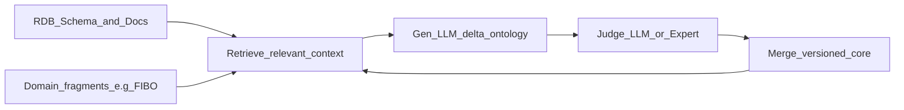
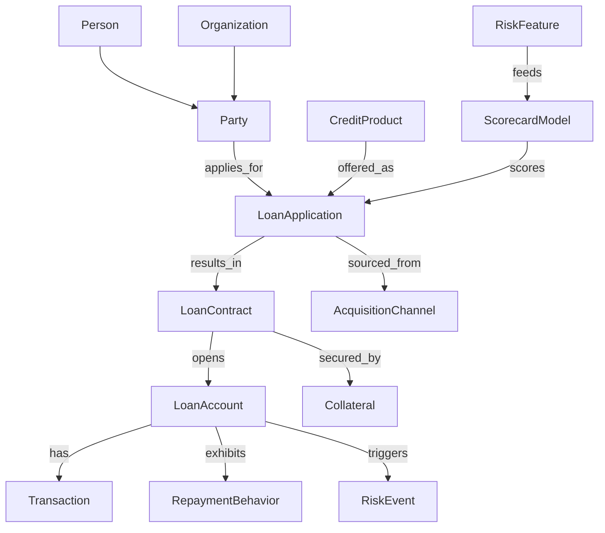
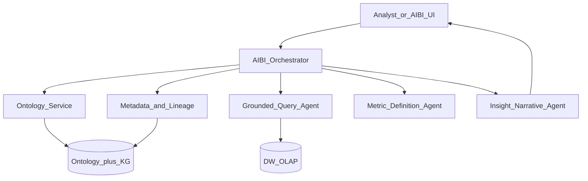

# 本体 × AIBI Data Agent — 产品愿景与工程对齐

> **读者**：产品 / 架构 / 核心研发  
> **目的**：统一「什么是本体、如何用 LLM 构建、消金形态长什么样、如何服务 AIBI、Prompt/Context/Harness 差异」的认知，并映射到 OntoMind 五层。  
> **性质**：愿景与设计对齐文档；明确区分 **当前仓库能力** 与 **目标形态**。  
> **相关**：[项目计划](./project-plan.md) · [资源管理设计](./RESOURCE_MANAGEMENT_DESIGN.md)

---

## 1. 定位

OntoMind 的核心理念是：**让数据自动生长为本体，让本体驱动决策与智能分析**。

应用层的 **AIbi** 不应满足于「自然语言 → 随意拼 SQL」，而应成为受本体约束的 **Data Agent**：问业务概念、取已治理口径、答案可追溯。

本文回答四个问题：

1. 本体是什么、相对裸表 / 纯向量 RAG 的优势是什么  
2. LLM 如何成体系地构建本体（而非一次性猜一整张 OWL）  
3. 消费金融场景本体主干长什么样  
4. 如何把本体嵌进 Agent Loop（Prompt / Context / Harness），支撑 AIBI

---

## 2. 本体论 vs 知识图谱 vs 语义层

| 层 | 定义 | 类比 |
|----|------|------|
| **Ontology（本体）** | 领域的「字典 + 语法」：类、属性、允许的关系、约束 | 数据库 DDL + 业务术语表 + 边类型契约 |
| **Knowledge Graph（知识图谱）** | 按本体灌入的真实实例与连接 | 真实行数据连成的图 |
| **Semantic Layer（语义层）** | 指标与口径的一致性定义（如「逾期」「不良」） | 指标字典 / 受治理的 metric |

三者关系可简记为：

- 本体规定「能有什么」  
- 图谱记录「实际有什么」  
- 语义层约定「业务怎么说指标」

### 2.1 对企业 Agent 的核心优势

- **消歧**：跨系统把「客户 / 客群 / Party / 交易对手」对齐到同一概念  
- **可推理**：沿显式关系多跳（人 → 合约 → 账户 → 风险事件），而不只靠文本相似  
- **可审计**：结论可回落到类型、边、Competency Question，利于监管与复盘  
- **给 Agent 接地**：限制可 join 的表、可用的指标，减少幻觉口径与乱连表  

> 实践建议：消费金融优先采用 **轻量本体**（类层级 + 属性 + 关系类型）。完整 OWL 重型推理按需引入；行业标准可局部对齐 [FIBO](https://edmcouncil.org/frameworks/industry-models/fibo/)，不必一期全量导入。

---

## 3. 如何用 LLM 构建本体

业界主流不是「一张大表一次生成完整本体」，而是 **小步、可校验的迭代管道**（同类思路见 RIGOR / OntoEKG / NeOn-GPT 等研究）：

### 3.1 推荐步骤

1. **输入**：表结构、字段注释、业务文档、已有领域本体片段  
2. **抽取（delta）**：按表 / 外键顺序生成类、对象属性、数据属性  
3. **对齐**：与核心本体、外部标准做命名与层级对齐  
4. **校验**：Judge-LLM / 领域专家 / Competency Questions  
5. **版本化合并**：合入核心后再处理下一批实体  

### 3.2 对照 OntoMind（当前 vs 目标）

| 能力 | 当前仓库（约） | 目标形态 |
|------|----------------|----------|
| 元数据采集与 LLM/Agent 标注 | 感知层已较成熟（`meta_*`、流式标注） | 注释与实体候选质量持续治理 |
| 本体构建 `rules` / `llm` / `agent` + 版本 + G6 | 认知层已有 API 与基础 UI | 标准片段复用、Judge 产品化、CQ 验收 |
| 实例种群（Instance Graph） | 偏弱 / 未产品化 | 与数仓主键实体解析打通 |
| 本体服务化查询 / 映射 API | 不足 | 供 AIBI / Data Agent 调用的 Router + 表白名单 |

---

## 4. 消费金融轻量本体示意

行业常参考 FIBO 的 Party / 合约 / 产品语义，再叠加信贷风险（申请人画像、打分卡、数据可追溯等）模块。消金一期建议先保证能回答：**客户是谁 → 申请了什么 → 合约/账户状态 → 为何逾期/风险**。

### 4.1 类簇速查

| 簇 | 示例类 | 典型属性 | 典型关系 |
|----|--------|----------|----------|
| 主体 | Person, Organization, Household | 标识、职业、收入区间 | belongs_to, related_party |
| 产品与合约 | CreditProduct, LoanContract, Limit | 利率、额度、期限、费项 | issues, underwrites |
| 账户与行为 | LoanAccount, Transaction, Repayment | 余额、逾期天数、动支 | posts_to, pays |
| 风险 | RiskEvent, CollectionCase, FraudSignal | 等级、时间、处置状态 | triggers, investigated_as |
| 获客与运营 | Channel, Campaign, Case | 渠道成本、转化 | sources |
| 决策资产 | Scorecard, Feature, StrategyRule | 分数、口径、版本 | derived_from |

**治理硬点**（不是画图完事）：实体解析（同一人多 ID）、指标口径（逾期定义）、物理表映射与血缘。

---

## 5. 本体 + Agent → 面向 AIBI 的 Data Agent

目标：**分析师 / AIBI 问业务概念；Agent 在本体约束下取数并回答。**

资源管理层的 Instance / Agent / Skill / MCP / AgentRun（见 [RESOURCE_MANAGEMENT_DESIGN.md](./RESOURCE_MANAGEMENT_DESIGN.md)）提供「谁在哪跑、有哪些工具」；**本体提供「能问什么、能连什么、口径是谁」**。两者缺一不可。

### 5.1 推荐能力切片

1. **Ontology Router**：用户问题落到哪些类 / 关系 / Competency Question  
2. **Semantic Composer**：只选用本体已登记的指标与口径，禁止自由发明字段  
3. **Grounded Query Agent**：SQL / Cypher / OLAP 只允许触达已映射物理对象  
4. **Evidence Binder**：答案附带实体路径 + 查询引用，可审计  
5. **Guardrails**：敏感列、租户隔离、结果一致性校验；生产环境 Agent 执行面必须鉴权  

相对纯向量 RAG：**本体约束语义与可达性，向量补充文档/注释**，互补而非替代。

---

## 6. Prompt / Context / Harness：核心差异

业界常把 Agent 质量拆成嵌套层（消息级 → 会话上下文级 → 系统编排级）：

| 维度 | Prompt Engineering | Context Engineering | Harness Engineering |
|------|--------------------|---------------------|---------------------|
| 核心问题 | 怎么说清楚任务 | 这一步该看什么信息 | 整条链路如何稳定跑完 |
| 作用范围 | 指令、角色、输出格式 | 检索片段、子图、schema、工具返回 | 工具编排、状态、重试、护栏、评测、多 Agent |
| 失败表现 | 听不懂、格式跑偏 | 噪音 / 缺失 / 冲突上下文 | 工具失败、无恢复、无观测、无权限边界 |
| 本体角色 | 可写入术语（弱） | **可检索的系统语义层（强）** | **路由与校验的一等资产（最强）** |

一句话：

- **Prompt**：扮演信贷分析师，按结构输出  
- **Context**：这一步塞入「逾期定义 + 相关实体子图 + 候选表白名单」  
- **Harness**：**怎么** plan → tool → observe → judge → retry，以及不准碰哪些库  

**Memory**（跨会话保留口径与结论）由 Harness 调度写入/读出，再喂给 Context。

### 6.1 Agent Loop 中本体如何提升效果

标准循环：`Observe → Plan → Act(tool) → Validate → Update memory → Loop`

| 阶段 | 无本体时 | 有本体时 |
|------|----------|----------|
| Observe | 用户话 + 原始表名 | 映射到类 / 关系 / 指标 ID |
| Plan | 模型猜测 join | 只沿允许边规划多跳；CQ 引导子目标 |
| Act | 任意 SQL / 任意 MCP | 工具参数用词表校验；表白名单来自映射 |
| Validate | 答案「像不像」 | 类型一致、口径正确、实体可达 |
| Compress | 粗暴截断 | 保留子图摘要，丢掉无关分支 |

**上下文预算（Select / Compress / Isolate）**：

- **Select**：按问题检索相关类与 1–2 跳邻居，而非全量 DDL  
- **Compress**：类级摘要 + 关键属性，代替整库 schema  
- **Isolate**：风控与营销分离子本体，避免口径串扰  

从「能建图」到「图进 loop」，是 OntoMind 支撑 AIBI 的关键跃迁。

---

## 7. OntoMind 五层映射与缺口

| 层 | 与本文关系 | 现状粗评 | 优先缺口 |
|----|------------|----------|----------|
| 感知 | 建本体原料（元数据 + 标注） | 较成熟 | 字段语义质量与血缘 |
| 认知 | 本体版本 / 图 / 应服务化 | 有 build + 可视化 | 查询 API、CQ、映射、Judge |
| 决策 | 特征 / 规则绑定本体论概念 | 骨架 | 概念级特征注册 |
| 执行 | 策略实体携带本体 ID | 骨架 | 可追溯下发 |
| 应用 AIBI | Data Agent Harness + 本体接地 | 骨架 | Orchestrator + Evidence Binder |
| 资源管理 | Agent / Skill / MCP 运行时 | 有设计与部分实现 | 与本体校验挂钩；生产须鉴权 |

### 7.1 建议能力切片（非排期承诺）

1. 认知层暴露：按问题检索子图、类→表映射、版本 diff  
2. AIBI MVP：自然语言 → Router → 受限 SQL → 带证据回答（单一消金域）  
3. Harness：统一 tool 白名单 + 失败重试 + 运行日志（复用 AgentRun）  
4. 文档与评测：用 Competency Questions 回归本体质量  

---

## 8. 非目标（本愿景刻意不做）

- 一期完整对齐 FIBO 全库或落地全量 OWL 重型推理器  
- 用纯 Prompt 替代本体治理与口径管理  
- 在未鉴权情况下把 Agent CLI / 数据预览当作生产 Data Agent  
- 用本文替代 [project-plan.md](./project-plan.md) 的阶段排期与人员计划  

---

## 参考与延伸阅读

- Ontology vs Knowledge Graph：[Atlan 解说](https://atlan.com/know/ai-agent/knowledge-graph/ontology-vs-knowledge-graph/)  
- Agentic AI 需要语义先行：[Forrester](https://www.forrester.com/blogs/build-meaning-before-machines-why-semantics-ontologies-and-knowledge-graphs-matter-for-agentic-ai/)  
- 金融行业本体标准：[FIBO (EDM Council)](https://edmcouncil.org/frameworks/industry-models/fibo/)  
- LLM 从库表迭代生成本体（示例方向）：[RIGOR / RAG of Ontologies](https://arxiv.org/html/2506.01232)  
- Prompt vs Context vs Harness：[Atlan 对比](https://atlan.com/know/harness-engineering-vs-prompt-engineering/)  
