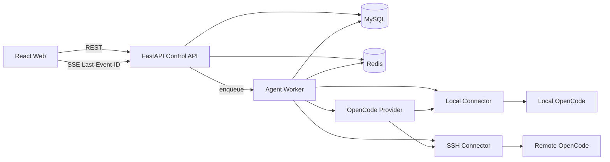
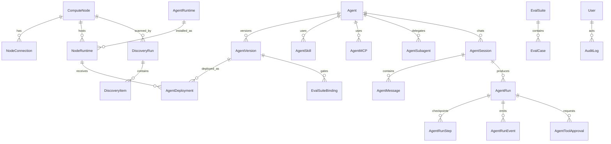
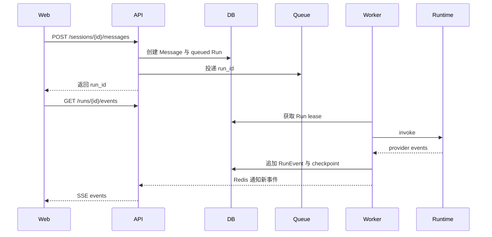

# Agent 资源管理平台技术方案

> 状态：待技术确认  
> 版本：v0.1  
> 前置确认：[产品功能规格](./01-product-spec.md)、[交互原型说明](./02-prototype-spec.md)  
> 本方案确认后才进入模型迁移、安全基线和真实功能实现。

## 1. 技术目标

在现有 FastAPI、SQLAlchemy、React 和 MySQL 架构上建立一个可靠的 Agent 控制平面，满足：

- 本机与 SSH Linux 节点接入。
- OpenCode Runtime、Agent、Skill 和 MCP 的发现与受控发布。
- Agent 单一配置真源、不可变版本和多目标 Deployment。
- 对话和长任务的统一 Run、持久化事件与实时展示。
- Loop、子 Agent、Hook、Eval 和工具审批。
- 团队 RBAC、凭据加密、远程执行约束和完整审计。
- 从现有 `instances`、`agents`、`agent_looper_configs` 和两套运行模型平滑迁移。

## 2. 关键技术决策

### 2.1 保持 FastAPI 单体控制面，增加独立 Worker

- FastAPI 负责认证、配置、资源查询、控制命令和 SSE。
- 独立 `agent-worker` 负责发现任务、发布任务和 Agent Run。
- Celery + Redis 只负责投递和实时通知，不作为业务状态真源。
- MySQL 是配置、状态、事件和审计的最终真源。
- 不引入 Temporal。

原因：

- 不允许长时间 SSH、CLI 或 Agent Loop 占用 API Worker。
- API 重启不应直接终止已入队任务。
- 现有项目已经包含 Redis 和 Celery 依赖，可以收敛闲置基础设施。
- 业务状态持久化在 MySQL，避免 Celery result backend 成为另一套状态系统。

### 2.2 实时协议采用 SSE + REST 控制

- `GET /runs/{id}/events` 使用 SSE 推送持久化 Run Event。
- 发送消息、批准工具、拒绝工具、暂停、恢复和取消均使用 REST。
- 浏览器断线通过 `Last-Event-ID` 补发事件。
- 第一版不为对话另建 WebSocket。

原因：

- 服务端到浏览器是主要数据方向。
- 审批和取消是低频显式命令，REST 足够。
- SSE 更容易通过网关、支持断线续传，也便于按事件 ID 恢复。
- 如果后续出现高频双向协作场景，再增加 WebSocket Gateway，但保持同一事件模型。

### 2.3 Agent 配置单一真源

- `agents` 保存可变的 Agent 基本信息和当前指针。
- `agent_versions` 保存不可变配置快照。
- `agent_deployments` 表示版本到 Runtime 的加载、发布、下线和回滚。
- `agent_looper_configs` 停止新增写入，迁移后只保留兼容读取窗口。
- OpenCode 文件不是配置主表，只是 Provider 的部署产物和发现来源。

### 2.4 统一 Run，移除 AgentRun/AgentRunJob 双概念

统一使用：

- `agent_runs`：一次执行。
- `agent_run_steps`：可恢复步骤和 checkpoint。
- `agent_run_events`：面向 UI 的追加事件流。
- `agent_tool_approvals`：工具审批。

`agent_runs.kind` 区分：

- `chat`
- `job`
- `eval`
- `discovery`
- `deployment`

长任务不是另一类根实体，而是持续时间更长、支持 pause/resume/checkpoint 的 Run。

### 2.5 Runtime 命名策略

- 产品和 API 使用 `Agent Runtime` / `/runtimes`。
- Wave 0 暂时保留内部 ORM 表 `agent_containers`，减少一次无业务价值的重命名迁移。
- 后续如无兼容压力，再迁移为 `agent_runtimes`。
- Python 领域层使用 `AgentRuntime` DTO，不继续向新代码传播 “Container 必然是 Docker” 的假设。

## 3. 目标架构



## 3.1 控制面模块

建议新增或收敛为：

```text
backend/app/
├── api/v1/agent_platform/
│   ├── nodes.py
│   ├── discoveries.py
│   ├── runtimes.py
│   ├── agents.py
│   ├── deployments.py
│   ├── sessions.py
│   ├── runs.py
│   ├── approvals.py
│   └── audit.py
├── connectors/
│   ├── base.py
│   ├── local.py
│   └── ssh.py
├── providers/
│   ├── base.py
│   └── opencode.py
├── execution/
│   ├── dispatcher.py
│   ├── worker_tasks.py
│   ├── run_supervisor.py
│   ├── event_writer.py
│   └── recovery.py
└── services/agent_platform/
    ├── node_service.py
    ├── discovery_service.py
    ├── agent_service.py
    ├── deployment_service.py
    ├── session_service.py
    ├── run_service.py
    ├── approval_service.py
    └── audit_service.py
```

现有 `/resources` 端点保留兼容窗口，通过 service 适配到新领域层，禁止继续直接操作旧 Repository。

## 4. 数据模型

## 4.1 核心关系



## 4.2 计算节点与连接

### `compute_nodes`

保留现有资源字段，补充：

- `id`
- `name`
- `hostname`
- `address`
- `platform`
- `platform_raw`
- `os_version`
- `architecture`
- `cpu_cores`
- `memory_mb`
- `disk_gb`
- `environment`
- `status`: pending/online/degraded/offline/maintenance/disabled
- `status_reason`
- `labels`
- `last_heartbeat_at`
- `last_scan_at`
- `created_by_user_id`
- `created_at`
- `updated_at`

节点唯一约束：

- `(address, environment)`。
- 本机使用稳定 machine fingerprint，不能只按 hostname 去重。

### `node_connections`

节点连接信息与节点元数据分离：

- `node_id`
- `connector_type`: local/ssh
- `port`
- `username`
- `credential_id`
- `host_key_algorithm`
- `host_key_fingerprint`
- `host_key_verified_at`
- `connect_timeout_seconds`
- `command_timeout_seconds`
- `max_concurrency`
- `enabled`

API 不返回凭据内容，只返回 `credential_id`、类型、更新时间和可用状态。

### `credentials`

- `id`
- `name`
- `credential_type`: ssh_private_key/ssh_password/llm_api_key/mcp_secret
- `encrypted_payload`
- `key_version`
- `masked_hint`
- `created_by_user_id`
- `rotated_at`
- `last_used_at`
- `created_at`
- `updated_at`

`encrypted_payload` 由 Fernet/MultiFernet 加密。业务 DTO 不允许包含该字段。

## 4.3 Runtime 与发现

### `agent_containers`

兼容表，领域上表示 Agent Runtime：

- `id`
- `provider_type`: opencode/openclaw/harness/custom
- `name`
- `version`
- `cli_path`
- `config_root`
- `process_name`
- `status`: discovered/managed/running/stopped/error/unsupported
- `capabilities`
- `last_heartbeat_at`

删除现有直接保存完整 `env` 的方式，只保存环境变量名称和 Secret 引用。

### `node_containers`

表示 Runtime 在节点上的安装实例：

- `node_id`
- `container_id`
- `install_path`
- `process_id`
- `port`
- `health_url`
- `status`
- `discovered_at`
- `last_seen_at`

唯一约束：`(node_id, container_id, install_path)`。

### `discovery_runs`

- `id`
- `node_id`
- `provider_type`
- `status`: queued/running/completed/partial/failed/cancelled
- `started_by_user_id`
- `started_at`
- `finished_at`
- `summary`
- `error_code`
- `error_message`

### `discovery_items`

- `discovery_run_id`
- `resource_type`: runtime/agent/skill/mcp
- `external_key`
- `source_path`
- `fingerprint`
- `status`: new/matched/changed/missing/unsupported/error
- `remote_snapshot`
- `platform_resource_id`
- `platform_snapshot`
- `diff`
- `decision`: pending/import/link/keep_platform/import_version/ignore/external
- `decided_by_user_id`
- `decided_at`

发现只写快照和决策，不直接覆盖正式资源。

## 4.4 Agent、版本和依赖

### `agents`

- `id`
- `name`
- `slug`
- `description`
- `agent_type`: custom/opencode_native/imported
- `status`: draft/loaded/testing/ready/published/offline/archived
- `owner_user_id`
- `current_draft_version_id`
- `current_published_version_id`
- `created_at`
- `updated_at`

`agents` 不再直接保存 system prompt、temperature、tool permissions 等可版本化配置。

### `agent_versions`

- `id`
- `agent_id`
- `version_number`
- `status`: draft/frozen/superseded
- `config_schema_version`
- `config_snapshot`
- `source`: manual/imported/copied/rollback
- `source_external_key`
- `change_summary`
- `content_hash`
- `created_by_user_id`
- `created_at`

`config_snapshot` 包含：

- objective
- success_criteria
- system_prompt
- model
- model_parameters
- context_policy
- collaboration
- loop
- sop
- hooks
- eval_bindings
- guardrails
- provider_overrides

版本冻结后不可修改。

### 依赖关联

- `agent_skills`
- `agent_mcps`
- `agent_subagents`

统一字段：

- `agent_version_id`
- `resource_id`
- `binding_type`: inherit/include/exclude
- `required`
- `config_override`

依赖绑定到 Version，不直接绑定可变 Agent，确保历史版本可复现。

## 4.5 Deployment

### `agent_deployments`

- `id`
- `agent_id`
- `agent_version_id`
- `node_container_id`
- `environment`
- `status`: pending/validating/deploying/active/draining/offline/failed/rolled_back
- `provider_release_id`
- `published_path`
- `previous_deployment_id`
- `requested_by_user_id`
- `approved_by_user_id`
- `started_at`
- `activated_at`
- `finished_at`
- `failure_code`
- `failure_message`

约束：

- 同一 `(agent_id, node_container_id)` 同时最多一个 active Deployment。
- 回滚创建新 Deployment，并引用 `previous_deployment_id`。
- 下线只修改 Deployment 状态，不删除 Version。

## 4.6 会话、消息与统一 Run

### `agent_sessions`

- `id`
- `agent_id`
- `agent_version_id`
- `user_id`
- `title`
- `status`: active/archived
- `created_at`
- `updated_at`

一个会话固定 Agent 和 Version。切换 Agent 创建新会话。

### `agent_messages`

- `id`
- `session_id`
- `role`: user/assistant/system/tool
- `content`
- `content_type`
- `run_id`
- `created_at`

### `agent_runs`

- `id`
- `run_key`
- `kind`: chat/job/eval/discovery/deployment
- `agent_id`
- `agent_version_id`
- `session_id`
- `parent_run_id`
- `deployment_id`
- `node_container_id`
- `status`: queued/running/awaiting_approval/paused/needs_review/completed/failed/cancelled
- `goal`
- `input_snapshot`
- `output_snapshot`
- `checkpoint`
- `current_step`
- `total_steps`
- `progress`
- `attempt`
- `lease_owner`
- `lease_expires_at`
- `started_by_user_id`
- `started_at`
- `finished_at`
- `error_code`
- `error_message`

### `agent_run_steps`

- `id`
- `run_id`
- `step_index`
- `step_key`
- `step_type`
- `agent_id`
- `status`
- `input_snapshot`
- `output_snapshot`
- `checkpoint`
- `started_at`
- `finished_at`

### `agent_run_events`

追加写，不更新历史事件：

- `id`
- `run_id`
- `sequence`
- `event_type`
- `payload`
- `visibility`: user/builder/admin
- `created_at`

唯一约束：`(run_id, sequence)`。

### `agent_tool_approvals`

- `id`
- `run_id`
- `event_id`
- `tool_name`
- `risk_level`
- `arguments_snapshot`
- `status`: pending/approved/rejected/expired
- `requested_at`
- `decided_by_user_id`
- `decided_at`
- `decision_reason`

## 4.7 Eval、Hook 与审计

### `eval_suites`

- `id`
- `name`
- `description`
- `combination_mode`: all_pass/weighted/critical_veto
- `pass_threshold`
- `owner_user_id`

### `eval_cases`

- `id`
- `suite_id`
- `eval_type`: rule/llm_judge/human
- `name`
- `criteria`
- `weight`
- `critical`
- `config`

MVP 中 Hook 和 SOP 配置保存在 AgentVersion 的 `config_snapshot`；当需要独立复用和权限时再拆表，避免首版过度建模。

### `audit_logs`

- `id`
- `actor_user_id`
- `action`
- `resource_type`
- `resource_id`
- `node_id`
- `run_id`
- `deployment_id`
- `request_id`
- `source_ip`
- `result`: success/failure/denied
- `summary`
- `details`
- `created_at`

审计写入失败时，高风险变更操作必须失败关闭，不能继续执行。

## 5. SSH Connector

## 5.1 库与接口

采用 `asyncssh`，以适配异步 Worker 和连接复用。

```python
class NodeConnector(Protocol):
    async def test_connection(self) -> ConnectionReport: ...
    async def get_host_info(self) -> HostInfo: ...
    async def run(self, command: CommandSpec) -> CommandResult: ...
    async def read_file(self, path: ManagedPath) -> bytes: ...
    async def write_file_atomic(self, path: ManagedPath, content: bytes) -> WriteResult: ...
    async def list_files(self, root: ManagedPath, pattern: str) -> list[FileInfo]: ...
    async def process_snapshot(self, selectors: list[ProcessSelector]) -> list[ProcessInfo]: ...
```

LocalConnector 和 SSHConnector 实现相同接口，Provider 不根据 local/remote 写两套发现逻辑。

## 5.2 Host Key 策略

- 禁止 `known_hosts=None` 或自动接受未知主机。
- 首次测试连接只读取服务端指纹，不执行管理命令。
- 管理员确认后保存算法和指纹。
- 后续指纹变化时节点进入 Degraded，停止扫描、发布和执行。
- 更新指纹需要单独权限、二次确认和审计。

## 5.3 凭据处理

- API 仅提交新凭据或 credential reference。
- Worker 在任务执行前按权限解密。
- 解密内容只存在于当前进程内存，不写临时文件；私钥使用内存对象加载。
- 日志过滤 password/private_key/token/api_key 等字段。
- 连接结束后释放引用。
- 支持 MultiFernet 轮换，并保存 `key_version`。

## 5.4 命令约束

禁止 API 或 Agent 直接提交任意 shell 字符串。

`CommandSpec` 由受信 Provider 定义：

```text
program: 固定可执行文件
args: 独立参数数组
cwd: 受管根目录下的路径
env_refs: 允许注入的 Secret 引用
timeout: 受平台上限约束
output_limit: stdout/stderr 上限
risk: read/write/process
```

安全规则：

- 不使用 `shell=True`。
- 不接受 `;`、管道、重定向或命令替换语义。
- 程序必须命中 Provider allowlist。
- cwd 和文件路径必须位于受管根目录。
- 命令、文件和输出都有大小限制。
- 每节点并发由 semaphore 控制。
- 任务有连接、命令和总运行超时。
- stdout/stderr 脱敏后再写 Event。

## 5.5 文件发布

OpenCode 文件发布：

1. 读取现有文件和 fingerprint。
2. 与发现或上次发布基线比较。
3. 不一致时进入冲突，不覆盖。
4. 在同目录写临时文件。
5. 校验格式。
6. 创建备份。
7. 原子 rename。
8. 重新读取并校验 fingerprint。
9. 写 Deployment 与审计结果。

## 6. OpenCode Provider

## 6.1 Provider 接口

```python
class AgentRuntimeProvider(Protocol):
    provider_type: str
    async def detect(self, connector: NodeConnector) -> RuntimeDetection: ...
    async def discover(self, connector: NodeConnector, runtime: AgentRuntime) -> DiscoverySnapshot: ...
    async def validate_version(self, version: AgentVersion, target: NodeRuntime) -> ValidationReport: ...
    async def load(self, version: AgentVersion, target: NodeRuntime) -> ProviderRelease: ...
    async def invoke(self, deployment: AgentDeployment, request: RunRequest) -> AsyncIterator[ProviderEvent]: ...
    async def stop(self, handle: ProviderRunHandle) -> None: ...
    async def offline(self, deployment: AgentDeployment) -> None: ...
```

## 6.2 OpenCode 发现

按只读顺序执行：

1. `which opencode`。
2. 获取版本。
3. 获取受限进程快照。
4. 确定配置根目录。
5. 读取 `opencode.json`。
6. 读取 Agent 配置。
7. 读取 `skills/**/SKILL.md`。
8. 标准化为 Provider DTO。
9. 生成稳定 fingerprint。
10. 与平台快照比较并写 discovery items。

发现错误按单项记录，非关键文件错误不应导致整个扫描失败。

## 6.3 OpenCode 调用事件映射

Provider 将 OpenCode JSONL 或结构化输出映射为统一事件：

- 文本增量 → `message.delta`
- 结构化步骤 → `step.started` / `step.completed`
- 工具调用 → `tool.requested`
- 工具结果 → `tool.completed`
- 子 Agent → `subagent.started` / `subagent.completed`
- 错误 → `run.error`
- 完成 → `run.completed`

不把 Runtime 原始事件直接透传到前端，避免前端绑定 OpenCode 私有协议。

## 7. Agent 执行与 Loop

## 7.1 Run 与 Loop 的关系

- 用户发送一次消息，创建一个 `chat` Run。
- 长任务创建一个 `job` Run。
- 一个 Run 使用一个 Loop Strategy。
- 子 Agent 调用创建 child Run，并通过 `parent_run_id` 关联。
- SOP 步骤写入 `agent_run_steps`。
- 每个可恢复步骤完成后写 checkpoint。

## 7.2 Worker 执行流程



## 7.3 Lease 与恢复

- Worker 开始执行时获取有过期时间的 DB lease。
- 正常运行定期续租。
- Worker 崩溃后 lease 过期，由 recovery task 接管。
- 有 checkpoint 的 Run 从最近安全步骤恢复。
- 无 checkpoint 的外部副作用步骤不能自动重试，进入 NeedsReview。
- 每个工具定义 `idempotent` 和 `retry_policy`。

## 7.4 取消与暂停

- Cancel API 先将 Run 标记为 cancellation_requested。
- Worker 通知 Provider 停止远程进程组。
- 停止成功后进入 Cancelled。
- 超时未停止时进入 Failed，并记录 orphan handle 供清理任务处理。
- Pause 只允许 checkpoint-safe 的 Job。
- Chat Run 不支持 Pause，只支持 Cancel。

## 7.5 Hook

Hook 由平台注册的受信 Action 执行，不接受用户提交脚本。

执行顺序：

1. run.before
2. step.before
3. tool.before
4. tool.after
5. step.after
6. eval.after
7. run.after 或 error

Hook 可以：

- enrich context
- validate
- redact
- audit
- notify
- request approval
- block

每次 Hook 都写 Run Event。

## 8. SSE 事件协议

## 8.1 Endpoint

```http
GET /api/v1/runs/{run_id}/events
Authorization: Bearer <token>
Accept: text/event-stream
Last-Event-ID: 42
```

## 8.2 事件格式

```text
id: 43
event: tool.requested
data: {"run_id":"run_01","sequence":43,"timestamp":"...","payload":{...}}
```

通用 envelope：

```json
{
  "run_id": "run_01",
  "sequence": 43,
  "type": "tool.requested",
  "timestamp": "2026-07-12T10:00:00Z",
  "visibility": "user",
  "payload": {}
}
```

## 8.3 事件类型

### Run

- `run.queued`
- `run.started`
- `run.paused`
- `run.resumed`
- `run.needs_review`
- `run.completed`
- `run.failed`
- `run.cancelled`

### Message

- `message.started`
- `message.delta`
- `message.completed`

### Step

- `step.started`
- `step.summary`
- `step.completed`
- `step.failed`

### Tool

- `tool.requested`
- `tool.awaiting_approval`
- `tool.approved`
- `tool.rejected`
- `tool.started`
- `tool.completed`
- `tool.failed`

### Sub Agent

- `subagent.started`
- `subagent.completed`
- `subagent.failed`

### Eval

- `eval.started`
- `eval.result`
- `eval.revision_requested`

## 8.4 可靠性

- Event 先写 MySQL，再发 Redis 通知。
- SSE 建连先补发 `sequence > Last-Event-ID` 的历史事件，再订阅实时通知。
- Redis 消息丢失时，API 按 DB 最新 sequence 补拉。
- 前端按 `(run_id, sequence)` 去重。
- 心跳使用 SSE comment，不写业务 Event。
- 终态后允许继续查询历史，不保持无限连接。

## 9. REST API

统一前缀：`/api/v1/agent-platform`。旧 `/resources` 和 `/agent-looper` 在兼容期映射到新 service。

## 9.1 Nodes

```text
GET    /nodes
POST   /nodes
GET    /nodes/{id}
PATCH  /nodes/{id}
POST   /nodes/{id}/connection-tests
POST   /nodes/{id}/host-key-confirmations
POST   /nodes/{id}/maintenance
POST   /nodes/{id}/disable
DELETE /nodes/{id}
```

## 9.2 Discovery

```text
POST   /nodes/{id}/discoveries
GET    /discoveries/{id}
GET    /discoveries/{id}/items
POST   /discoveries/{id}/items/{item_id}/decisions
POST   /discoveries/{id}/apply
POST   /discoveries/{id}/cancel
```

`apply` 只应用已经明确决定的 items。

## 9.3 Agent 与版本

```text
GET    /agents
POST   /agents
GET    /agents/{id}
PATCH  /agents/{id}
POST   /agents/{id}/archive
GET    /agents/{id}/versions
POST   /agents/{id}/versions
GET    /agents/{id}/versions/{version_id}
POST   /agents/{id}/versions/{version_id}/freeze
POST   /agents/{id}/versions/{version_id}/validate
POST   /agents/{id}/versions/{version_id}/load
```

## 9.4 Deployment

```text
GET    /deployments
POST   /deployments
GET    /deployments/{id}
POST   /deployments/{id}/drain
POST   /deployments/{id}/force-offline
POST   /deployments/{id}/rollback
```

发布和回滚返回关联 Run ID，由 Run SSE 展示进度。

## 9.5 Session、Message 与 Run

```text
GET    /sessions
POST   /sessions
GET    /sessions/{id}
PATCH  /sessions/{id}
POST   /sessions/{id}/messages
GET    /sessions/{id}/messages
GET    /runs
GET    /runs/{id}
GET    /runs/{id}/events
POST   /runs/{id}/cancel
POST   /runs/{id}/pause
POST   /runs/{id}/resume
POST   /runs/{id}/retry
```

## 9.6 Approval

```text
GET    /approvals?status=pending
POST   /approvals/{id}/approve
POST   /approvals/{id}/reject
```

审批接口要求 `expected_status=pending`，通过乐观锁防止重复决定。

## 10. 认证、RBAC 与资源范围

## 10.1 默认策略

- `/agent-platform` 下所有接口默认必须认证。
- 路由不逐个“选择是否加认证”，而是在 Router 层统一依赖。
- SSE 与普通 REST 使用同一 Bearer Token 和资源权限校验。
- 关闭生产环境公开注册。

## 10.2 角色

- `platform_admin`
- `agent_builder`
- `agent_user`
- `auditor`

权限示例：

- `node.read`
- `node.manage`
- `credential.manage`
- `discovery.execute`
- `agent.read`
- `agent.edit`
- `agent.debug`
- `agent.publish.test`
- `agent.publish.prod`
- `run.execute`
- `run.cancel`
- `tool.approve.low`
- `tool.approve.high`
- `audit.read`

## 10.3 数据范围

第一阶段单组织，但仍保存：

- owner
- environment
- labels
- explicit grants

Service 查询必须接收 `AccessContext`，Repository 不自行推断当前用户。

## 10.4 高风险操作

以下操作要求权限、二次确认、reason 和审计：

- 接受或更新 SSH host key。
- 创建、轮换和删除凭据。
- 生产发布。
- 强制下线。
- 强制取消远程 Run。
- 批准高风险工具。

## 11. 配置与启动安全

生产环境启动时强制验证：

- `SECRET_KEY` 不是默认值。
- `FERNET_KEY` 有效。
- `DATABASE_URL` 使用生产配置。
- `DEBUG=false`。
- CORS 不含通配符。
- Redis 可达。
- Alembic revision 等于 head。

开发环境可以显式使用弱化配置，但必须在日志中警告。

## 12. 数据迁移方案

采用 Expand → Backfill → Switch → Contract。

## 12.1 Revision 0：修正 Alembic 基线

- `alembic/env.py` 统一引用 `app.db.models.Base.metadata`。
- 为现有数据库建立可验证 baseline revision。
- 增加 CI：空库 `upgrade head` 和已有 schema 迁移。
- `create_all()` 仅在 `ENVIRONMENT=development` 且显式开关开启时允许。

## 12.2 Revision 1：新增目标表

新增：

- credentials
- node_connections
- discovery_runs
- discovery_items
- agent_versions
- agent_deployments
- agent_sessions
- agent_messages
- agent_run_steps
- agent_run_events
- agent_tool_approvals
- eval_suites
- eval_cases
- audit_logs
- RBAC 相关表

同时为 `compute_nodes`、`agents` 和 `agent_runs` 增加兼容字段。

## 12.3 Backfill 计算节点

- `instances` → `compute_nodes`。
- host/port/protocol/credential 拆分到 node_connections 和 credentials。
- 明文 credential 读取后立即加密写入。
- 迁移脚本输出数量、失败记录和 hash，不输出明文。
- `agent_runs.instance_id` 映射到新 node/runtime 关系。

## 12.4 Backfill Agent

- 合并旧 `agents` 和 `agent_looper_configs`。
- 同名资源不自动合并，按来源和内容 hash 生成冲突报告。
- 每个配置生成 AgentVersion v1。
- `agent_looper_versions` 迁移为后续 AgentVersion。
- `current_version_id` 和 `is_published` 映射到 Agent 指针和 Deployment。
- 旧 published path 保存为 Provider metadata。

## 12.5 Backfill Run/Job

- 旧 `agent_runs` 迁为 `kind=chat` 或可推断类型。
- `agent_run_jobs` 迁为 `kind=job`。
- 原 `steps` JSON 拆到 agent_run_steps。
- 无法确认状态的 running 记录迁为 needs_review，不伪造 completed。

## 12.6 Switch

- 新 API 和新前端只写目标表。
- 旧 `/resources` 与 `/agent-looper` 只通过适配层调用新 service。
- 增加旧写入监控。
- 兼容期内禁止双写两套独立业务逻辑。

## 12.7 Contract

满足以下条件后删除旧表和字段：

- 连续一个发布周期无旧写入。
- 迁移对账通过。
- 旧 URL 调用量为零或调用方已升级。
- 回滚快照可用。

## 13. 可观测性

每个请求、Run、Deployment 和 Discovery 都携带：

- `request_id`
- `run_id`
- `deployment_id`
- `node_id`
- `actor_user_id`

指标：

- 节点在线率和连接延迟。
- SSH 失败率和超时。
- Discovery 成功率、耗时和冲突数。
- 发布成功率、耗时和回滚率。
- Run 排队时间、执行时间、失败率和取消率。
- 工具审批等待时间。
- Eval 通过率和平均修订次数。
- SSE 当前连接数和补发事件数。

日志禁止记录：

- 凭据明文。
- 完整私钥。
- API Key。
- 未脱敏工具参数和输出。
- 模型私有思维链。

## 14. 测试方案

## 14.1 单元测试

- Node 状态机。
- Agent、Deployment 和 Run 状态机。
- RBAC permission matrix。
- Fernet 加密、轮换和脱敏。
- CommandSpec allowlist 和路径约束。
- OpenCode parser、fingerprint 和 diff。
- Event sequence、去重和可见性。
- Loop、Hook 和 Eval 组合。

安全边界负例要求全覆盖。

## 14.2 集成测试

使用临时 SSH Server 或协议级 fake：

- Host key 首次确认和变更拒绝。
- 密钥、密码、超时和网络失败。
- 远程只读发现。
- 原子文件发布与冲突。
- 远程进程启动、事件读取和取消。
- Worker 崩溃后的 lease 恢复。
- MySQL Alembic 空库和旧库迁移。
- Redis 通知丢失时从 DB 补事件。

## 14.3 API 契约测试

每个管理 API 至少覆盖：

- 成功。
- 401 未认证。
- 403 无权限。
- 404 资源不可见。
- 409 状态或版本冲突。
- 下游 Connector/Provider 失败。

验证响应中不存在 private_key/password/token/encrypted_payload。

## 14.4 前端测试

Vitest：

- Run event reducer。
- Agent Picker 权限与状态过滤。
- 工具审批状态。
- Discovery conflict decision。
- Studio 配置完整度。
- Deployment 状态。

Playwright 主路径：

1. 注册本机并发现 OpenCode。
2. 注册远程 Linux。
3. Host key 不一致时阻断。
4. 发现并导入资源。
5. 处理 Agent 冲突。
6. 从模板创建 Agent。
7. 对话与工具审批。
8. Eval 失败阻止发布。
9. 发布测试环境。
10. Draining 下线。
11. 回滚历史版本。
12. 审计查询。

## 14.5 发布门禁

- 全量 pytest 通过。
- 前端 TypeScript build 通过。
- 关键 Playwright 全绿。
- Alembic 空库与旧库迁移通过。
- 安全负例通过。
- 无默认 SECRET_KEY。
- 无明文凭据响应。
- 无匿名 `/resources` 或 `/agent-platform` 管理接口。

## 15. 实施顺序

### Wave 0：基线

1. 修复现有集成测试和前端 build 基线。
2. 修正 Alembic metadata 与 baseline。
3. 新增 Credential、RBAC 和 Audit。
4. `/resources`、`/users`、`/llm` 管理面统一认证。
5. 执行 Agent 和 ComputeNode 数据迁移。

### Wave 1：节点与发现

1. Connector 接口。
2. LocalConnector。
3. SSHConnector。
4. OpenCode Provider 发现。
5. Discovery Run/Item 与冲突决策。
6. 节点向导和发现 UI。

### Wave 2：生命周期

1. AgentVersion。
2. 版本依赖绑定。
3. Provider validate/load。
4. Deployment。
5. 发布、drain、下线和回滚。

### Wave 3：对话与 Run

1. Session/Message。
2. 统一 Run 和 Event。
3. Worker、lease 和 recovery。
4. SSE + Last-Event-ID。
5. 工具审批。
6. 默认对话首页。

### Wave 4：Agent Studio

1. 十步配置 schema。
2. 协作拓扑。
3. Loop/SOP。
4. Hook。
5. Eval Suite。
6. Guardrail 和发布门禁。

### Wave 5：运营

1. 运行中心。
2. 审计中心。
3. 指标和告警。
4. 故障注入和恢复演练。
5. 生产镜像与部署文档。

## 16. 主要风险与控制

### 远程代码执行风险

控制：Provider allowlist、CommandSpec、无 shell、目录约束、超时、并发、审计和权限。

### SSH 凭据泄露

控制：独立 Credential、Fernet、只写不回显、即时解密、日志脱敏和轮换。

### OpenCode 配置覆盖

控制：fingerprint、发现快照、人工冲突、发布 diff、备份和原子写。

### Worker 崩溃和重复执行

控制：DB lease、checkpoint、工具幂等属性、外部副作用步骤禁止盲重试。

### 双模型迁移

控制：expand/backfill/switch/contract、数量和 hash 对账、兼容适配层、禁止长期双写。

### 事件丢失

控制：MySQL 先写、Redis 只通知、sequence、Last-Event-ID 和补拉。

## 17. 技术确认清单

请确认以下关键决策：

1. FastAPI 控制面 + 独立 Celery Worker。
2. MySQL 为状态真源，Redis 只用于队列和实时通知。
3. SSE + REST 控制，不继续扩展现有对话 WebSocket。
4. `agents + agent_versions + agent_deployments` 单一 Agent 模型。
5. 统一 `agent_runs`，不长期保留 AgentRunJob 双概念。
6. 内部暂留 `agent_containers` 表，产品/API 使用 Agent Runtime。
7. 使用 AsyncSSH，并强制 host key confirmation。
8. OpenCode Provider 只能执行受控命令和受管路径操作。
9. AgentVersion 保存不可变配置快照，依赖绑定到 Version。
10. Hook 首版只允许平台注册 Action，不允许用户脚本。
11. Eval Suite 支持规则、LLM Judge、人工和混合。
12. Expand → Backfill → Switch → Contract 迁移策略。

确认后首先实施 Wave 0，不会直接跳到 SSH 或 Agent 对话功能。
