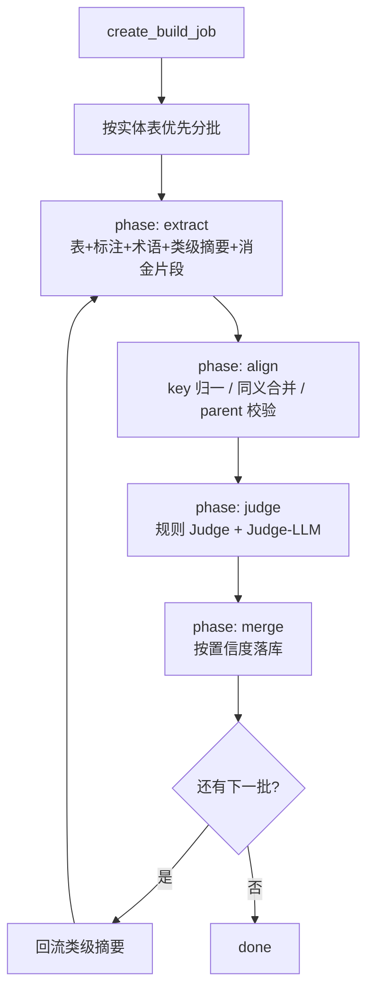

# DataOps · Wiki / 元数据标注 / 本体建模

> **版本**: v1.0 | **日期**: 2026-08-14 | **关联**: [ONTOLOGY_AIBI_DATA_AGENT.md](../ONTOLOGY_AIBI_DATA_AGENT.md)

---

## 1. 目标链路

```
企微/Word/网页 ─粘贴/URL─→ Wiki(Markdown)
                              ↓ 术语抽取
Doris information_schema ─扫描─→ meta_tables/columns + profile
                              ↓ 规则 / LLM / hybrid 标注
                         annotations（人审）
                              ↓ delta 构建
                         Ontology（类/属性/关系/映射/指标）
                              ↓ CQ 验收 → 发布版本 → 导出
```

前端入口：

| 页面 | 路由 |
|---|---|
| 知识库 | `/dataops/catalog/knowledge` |
| 元数据与标注 | `/dataops/catalog/biz-systems` |
| 本体建模 | `/dataops/catalog/ontology` |

API 前缀：`/api/v1/wiki` · `/api/v1/metadata` · `/api/v1/ontology`

---

## 2. 数据模型（17 张新表）

### Wiki（3）

| 表 | 要点 |
|---|---|
| `wiki_spaces` | slug 唯一；启动种子 `default` |
| `wiki_documents` | parent 树、版本号、tags_json、source_type |
| `wiki_document_versions` | UQ(document_id, version)；回滚写新版本 |

### Metadata（5）

| 表 | 要点 |
|---|---|
| `meta_scan_jobs` | job_kind=`scan`\|`annotate`；progress / stats_json |
| `meta_tables` | UQ(source_id, database, table_name)；保留人工 biz_* |
| `meta_columns` | profile_json；biz_name / domain |
| `glossary_terms` | 来自 Wiki rules/llm 或手工 |
| `annotations` | target + label_kind + confidence + status |

### Ontology（9）

| 表 | 要点 |
|---|---|
| `ontologies` | slug、current_version |
| `ontology_build_jobs` | phase extract→align→judge→merge |
| `ontology_object_types` / `properties` / `link_types` | confidence + source + status |
| `ontology_mappings` | 本体元素 ↔ 物理表列 |
| `ontology_metrics` | sql_expr **只存不执行** |
| `ontology_cqs` | verify_status + verify_note |
| `ontology_versions` | snapshot_json / diff_json |

---

## 3. 置信度阈值（标注与本体共用）

| 区间 | 行为 |
|---|---|
| `≥ 0.85` 且无人工冲突 / Judge pass | `accepted`，回写业务字段或落核心本体 |
| `0.65 ~ 0.85` 或 Judge warn | `suggested` / `draft`，待人审 |
| `< 0.65` 或规则 Judge fail | 不进人审队列 / `rejected` |

常量：`CONF_AUTO_ACCEPT = 0.85`，`CONF_SUGGEST_MIN = 0.65`。

已有 `accepted` 人工标注：**不覆盖**，新候选一律 `suggested`。

---

## 4. 本体 Delta 管道



关系推断（Doris 无 FK）三路投票：命名约定 0.4 + `overlap_ratio` 0.4 + LLM 语义 0.2。

导出：`json` / `jsonld` / `turtle`（手写序列化，不引 rdflib）。

---

## 5. CQ 验收标准

1. 问题概念能匹配到 `object_type` / `metric`
2. 涉及类之间存在 `link_type` 路径（BFS，depth ≤ 3）
3. 涉及类/属性有物理 `mapping`
4. `verify_all` 通过率作为本体质量核心指标

---

## 6. 约束与坑

- LLM 未配置：`LLM_NOT_CONFIGURED`；**rules 模式必须可跑**
- 扫描注释：走 `information_schema`，勿裸 DESCRIBE
- 长任务：`job_runner` 独立线程 + Session，勿绑 request BackgroundTasks
- Service **禁止** `with self.db.begin()`
- `fetch-url` 拒绝内网 SSRF
